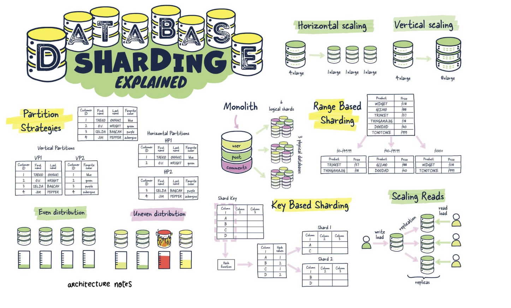

# 뉴비 게임 서버 프로그래머를 위한 학습 자료
    
## C++ 
  
### 학습
- [가상함수와 클래스 상속 계층도](https://docs.google.com/presentation/d/1m3u7CwXAYwVQ6yCGT4OQ-32VCXgSHcICO-cdPb-c84o/edit?usp=sharing)
- [RAII 해설](https://docs.google.com/presentation/d/1-Pft2eHxylKBNmVTIoExshbLXoTXW7DfuGA1170hwnM/edit?usp=sharing )
- [대단한 const를 재미있게 사용하자](https://docs.google.com/presentation/d/16Z_C-KVn1oPddQwS3UrZgT0ocLX064gAop_nE1UmUHo/edit?usp=sharing )
- [자세히 알아보는 C++의 include](https://docs.google.com/presentation/d/10wi2B41U8XW2HmGCgBvsWsQZYVO-I4fiDkK3tmYsZZM/edit?usp=sharing )
- [전방 선언](https://docs.google.com/presentation/d/1nnjO-JmwtTFDTSI-8hamYbey7mS5OGjHl8aBZ8SzWfI/edit?usp=sharing )
- [지금 C++ 프로그래머에게 인기 있는 리소스 관리술](https://docs.google.com/presentation/d/1SaRlLA1s7jg5KEszeXk9coVNbFCgjCQrXz6MPRre_0g/edit?usp=sharing )
- [C++ 클로져 디자인패턴(C++ lambda)](https://docs.google.com/presentation/d/1gjSxgyt2Jc5sR46sphW7plxfMyKh1XNg7SzMin17pBs/edit?usp=sharing )
- [C++ 구조체 alignment](https://docs.google.com/presentation/d/1lp6zNvUqlgmwyXiiweD_lipNf14_nb7xylXUUySesaw/edit?usp=sharing )
- Thread  
    - [규격서에서 보는 C++11 Thread](https://docs.google.com/presentation/d/1ZYW8cSAuP7mRNtWRrwJuyfuDaBRuU_YhwDyyXn_FQF0/edit?usp=sharing ) 
    - [C++11 threads, affinity and hyperthreading](https://docs.google.com/presentation/d/1UdPCUX91nFjRp-05o6Eb2uFZcuJJyX6A7wqfCgLHNKI/edit?usp=sharing ) 
    - [C++ 멀티 쓰레드 프로그래밍](https://docs.google.com/presentation/d/1FFpxz-eYH76am0MPusTU9vwDhLfi5DE7K65XiyfQkVE/edit?usp=sharing ) 
    - [C++ 멀티스레드 프로그래밍 입문](https://docs.google.com/presentation/d/1TZvqVNRwi3KJYoCC_1tBzf01VUBZXeaEtFjs3Z6iaMI/edit?usp=sharing ) 
- Concurrency Runtime
    - [VC++ 10 Concurrency Runtime (한글)](https://vsts2010.tistory.com/category/VC++%2010%20Concurrency%20Runtime?page=2 ) 
    - [MS Docs: 동시성 런타임](https://docs.microsoft.com/ko-kr/cpp/parallel/concrt/concurrency-runtime?redirectedfrom=MSDN&view=vs-2019 ) 
    - [Parallel Programming with Microsoft Visual C++](https://docs.microsoft.com/en-us/previous-versions/msp-n-p/gg675934(v=pandp.10)?redirectedfrom=MSDN )   
  
### 네트워크 프로그래밍 
- [YOUTUBE 뇌를 자극하는 TCP/IP 소켓 프로그래밍](https://www.youtube.com/playlist?list=PLVsNizTWUw7GZy4UA9pntGRC9IIXIYiHm )
- [YOUTUBE C++ Korea 제6회 세미나 - 채팅 서버 개발로 알아보는 C++의 기능들](https://youtu.be/JxejgUKTViQ )
  

### 실습
- [채팅 서버 만들기](https://www.youtube.com/watch?v=eiwvQ8NV2h8)
- [단계 별로 IOCP 실습](https://github.com/jacking75/edu_cpp_IOCP )
- [오래된 IOCP API를 사용한 네트워크 라이브러리](https://github.com/jacking75/edu_cpp_server_programming/tree/main/opensource/edu_CQNetLib-master ) 를 최신 C++ 코드로 리팩토링 한다
- [C++ 서버 프로그래밍 실습](https://github.com/jacking75/edu_cpp_server_programming )
- [C++로 HTTP 통신하기](https://github.com/jacking75/how_to_use_cpp_http_client )
      

   
    
## C# 
- [(인프런 무료 영상) C# 초보 강좌 예제로 배우는 C# - 11 강 ∙ 8시간 17분](https://inf.run/PVsq ) 
- [(인프런 무료 영상) C# 처음부터 배우기 - 커리큘럼 총 11 개 ˙ 3시간 53분의 수업](https://inf.run/bfkW ) 
- [(인프런 무료 영상) C# 프로그래밍 - 커리큘럼 총 63 개 ˙ 29시간 56분의 수업](https://inf.run/PueZ )  
- [(유튜브) C# 교과서 마스터하기](https://www.youtube.com/watch?v=R4Br77_cHHU&list=PLO56HZSjrPTB4NxAsEP8HRk6YKBDLbp7m )  
- [C# 멀티스레드 프로그래밍 정리](https://github.com/jacking75/csharp_multithread_programming )
  

### API Server - ASP.NET Core
- [ASP.Net Core Web API Server 학습](https://github.com/jacking75/edu_Learn_ASPNetCore_APIServer )
- [DAO, DTO, VO 란? 간단한 개념 정리](https://melonicedlatte.com/2021/07/24/231500.html )
  

### 네트워크 프로그래밍
- [C# 네트워크 프로그래밍 학습](https://github.com/jacking75/edu_CSharpNetworkProgramming )  
- SuperSocket
    - [Echo Server 만들기](https://www.youtube.com/watch?v=ZgzMuHE43hU )
    - [Chat Server 만들기](https://www.youtube.com/watch?v=eiwvQ8NV2h8 )
  
    
   
    
## Linux
- [(인프런 무료 영상) '이것이 리눅스다' 저자의 Red Hat CentOS7 리눅스 서버&네트워크 강좌 - 커리큘럼 총 57 개 ˙ 22시간 28분의 수업](https://inf.run/yf7K )   
- [(인프런 무료 영상) 생활코딩 - Linux](https://inf.run/9Yxy ) 
- [토크ON세미나 리눅스와 친해지기](https://www.youtube.com/watch?v=pgXYkzl35HM&list=PL9mhQYIlKEhc6Odsnn1igZ9Qd-fWasQI7 )
- [Linux 기본 명령어 모음](./linux_basic_cmd.md )
- [Bash 입문자를 위한 핵심 요약 정리 (Shell Script)](https://blog.gaerae.com/2015/01/bash-hello-world.html )
   
  
### WSL
- [WSL2 글모음](https://gist.github.com/jacking75/a4f3cb450bdf8ddfae15eaab58343cf5 )  
  
  
### docker
비 Linux에서 docker를 다룰 때는 `Docker for Desktop` 프로그램을 사용한다. **개인적인 용도로 사용할 때만 무료**   
어디에서나 무료로 `Docker for Desktop` 같은 프로그램을 사용하고 싶다면 `Rancher Desktop` 을 추천한다.  
  
- [Windows에서 Docker 환경을 바꿨다 (Docker Desktop → Rancher Desktop)](https://docs.google.com/document/d/e/2PACX-1vSd9sgy5IWAk5J74YZ0ndqa7djhp3xh6IVSmu-gJOtRBMEIKbRNOIieQhSQHx-6sMguh6ZvydirQipn/pub )
- [Docker 알아보아요! (2019)](https://mysetting.io/slides/docker-basic ) 
- [생활 코딩 - docker](https://opentutorials.org/course/4781/30609 ) 
- [Best practices for writing Dockerfiles 요약](https://docs.google.com/document/d/1gSJW9agm--xyeO3MuDzTT3XsFxdo3k250H_GrnRUQ9k/edit?usp=sharing )  
    
- 실습 자료
    - [2024-01 김성연님 실습 자료](/docker/docker-202301_ksy)
  	
  
   
  
## DB 
- [(유튜브) 데이터베이스 입문](https://www.youtube.com/playlist?list=PLcXyemr8ZeoREWGhhZi5FZs6cvymjIBVe )    
- [(YOUTUBE) 즐겁게 배우는 SQL](https://www.youtube.com/watch?v=AO5Q7zggJAk&list=PLdntWJk2tJPLinuRXcokohNLgc83ejwUt )
- 추천 도서 
    - SQL 첫걸음 
    - 모두의 SQL 누구나 쉽게 배우는 데이터 분석 기초
  
  원 출처: https://twitter.com/bibryam/status/1606316891307483136/photo/1   
  

### MySQL
- [한방으로 db 환경 구축하기](https://docs.google.com/document/d/e/2PACX-1vQ8hKrDGdI62JzjoXxUpbHOwBhNkg7mBnDYP5QNj26yIE17V-lWza0-UV6GpPATZ1Cv_YTQ4ysynAX5/pub )   
   
  

### Redis 
- [(영상) Redis 야무지게 사용하기](https://forward.nhn.com/2021/sessions/16 ) 
- [Redis 글 모음](https://gist.github.com/jacking75/5d9927851b22a539774301017e0cefd7 ) 
- [(유튜브) C++를 이용한 Redis 프로그래밍](https://www.youtube.com/watch?v=pGo1TnPH43Y&t=16s )  
- [(유튜브) Redis C# 프로그래밍](https://www.youtube.com/watch?v=09ufiNEWynk )
- [redis 라이브러리 사용 방법 정리](https://github.com/jacking75/how_to_use_redis_lib )
    
  
     

## CS 학습
- [(무료 인강) 개발자를 위한 컴퓨터공학 1: 혼자 공부하는 컴퓨터구조 + 운영체제](https://inf.run/b2yR )
- [(YOUTUBE 널널한 개발자) 넓고 얕게 배우는 컴퓨터 구조, 자료구조와 알고리즘, 프로그래밍, 운영체제](https://www.youtube.com/watch?v=ucBfQGpNjPo&list=PLXvgR_grOs1BQCziQ_MpM877BdBxwbMzA )
- [(인프런 무료) 운영체제 공룡책 강의](https://inf.run/EvsF )
- [(YOUTUBE 널널한 개발자) 네트워크 기초 이론](https://www.youtube.com/watch?v=k1gyh9BlOT8&list=PLXvgR_grOs1BFH-TuqFsfHqbh-gpMbFoy )
- [(YOUTUBE 널널한 개발자) 네트워크 응용](https://www.youtube.com/watch?v=7BvzxbG4y3Y&list=PLXvgR_grOs1BkUIxKsLEUdefyMWMA0_U- )
- [(YOUTUBE 널널한 개발자) 암호기술에 대한 최소 이론](https://www.youtube.com/watch?v=HtETF-NL81A&list=PLXvgR_grOs1CakfdJgCy_Df14U3DqRuPk )
- [동시성, 병렬, 비동기, 논블럭킹과 컨셉들](https://black7375.tistory.com/90 )
- [(운영체제: 아주 쉬운 세 가지 이야기(출판된 책으로 무료 버전)](https://github.com/remzi-arpacidusseau/ostep-translations/tree/master/korean )
- [(인프런, 무료) 개발자를 위한 컴퓨터공학 1: 혼자 공부하는 컴퓨터구조 + 운영체제](https://inf.run/qq22 )
- [(인프런 무료 온라인 강의) 뇌를 자극하는 윈도우즈 시스템 프로그래밍](https://inf.run/76wV )
- [(유튜브) 따라하면서 배우는 IT](https://www.youtube.com/channel/UCl9zTDOvOxdCfUt1HqVwwdg )
- [10가지 소프트웨어 아키텍처 패턴 요약](https://mingrammer.com/translation-10-common-software-architectural-patterns-in-a-nutshell/ )    
- [최신 네트워크 로드 밸런싱 및 프록시 소개](https://ziwon.github.io/post/modern-network-load-balancing-and-proxying/ ) 
- [대규모 서비스를 설계하는 기술](https://www.slideshare.net/charsyam2/how-to-build-massive-service-for-advance ) 
- [개발자를 위한 인프라 기초 총정리](https://futurecreator.github.io/2018/11/09/it-infrastructure-basics/ )  
- [HTTPS에 대한 기초 이해](https://cheese10yun.github.io/https/ ) 
- [멀티 플레이게임의 서버 형태와 그 특징에 대해서](http://bit.ly/2YXBjGV )
- [게임 서버의 목차 - 시작부터 출시까지, NDC2019](https://www.slideshare.net/devcatpublications/ndc2019-142915563 )
- [게임 서버 디자인 가이드, NDC2013](http://www.slideshare.net/devcatpublications/ndc2013-19986939 )
- [온라인 게임 서버 구조와 테크닉](http://www.slideshare.net/imaifactory/ss-48388661 )
- [라이브 서비스를 위한 게임 서버 구성](http://www.slideshare.net/hyunjikbae1/ss-60081243 )
- [게임 분산 서버 구조](http://www.slideshare.net/hyunjikbae1/ss-35206140 )
- [스마트폰 온라인 게임에서 고려해야 할 것들](http://www.slideshare.net/hyunjikbae1/ss-39522754 )
- [C++ Korea 제9회 세미나 - 유지보수 편하게 게임 서버 만들기 (허린)](https://www.youtube.com/watch?v=NiDbkG_Eqpo )

## 추천 도서
- 면접을 위한 CS 전공지식 노트
- 학교에서 알려주지 않는 17가지 실무 개발 기술
- 모두의 네트워크
- 그림과 작동 원리로 쉽게 이해하는 서버의 기초
- 그림으로 쉽게 이해하는 웹/HTTP/네트워크
- 동료들 뒷목 잡게 만드는 나쁘 프로그래밍 습관
