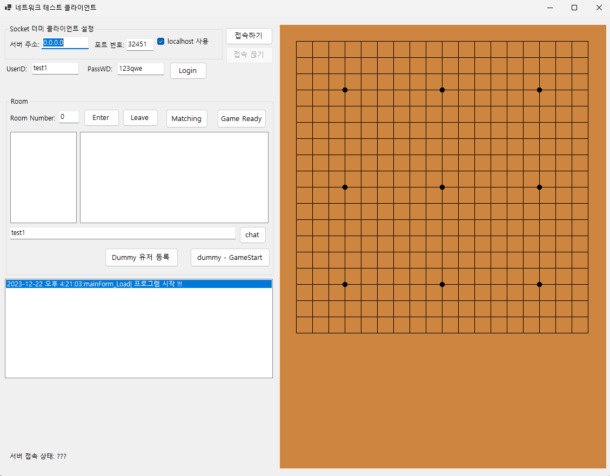

# 오목 클라이언트 코드 저장소 
  
## CSharp_OmokClient_1 , CSharp_OmokClient_3
- C# 8.0
- WinForm
- 네트워크 클라이언트용으로 만든 것
- 패킷 데이터 포맷은 MessagePack을 사용
- 닷넷프레임워크 때 만든 Winform에서 마이그레이션 하면서 지원하지 않는 라이브러리 문제로 디자인시에 폼 디자이너가 나오지 않음. 실행에는 문제 없음  
    
  
## CSharp_OmokClient_2
- C# 8.0
- WinForm
- 네트워크 클라이언트용으로 만든 것
- 패킷 데이터 포맷은 바이너리를 사용
- 닷넷프레임워크 때 만든 Winform에서 마이그레이션 하면서 지원하지 않는 라이브러리 문제로 디자인시에 폼 디자이너가 나오지 않음. 실행에는 문제 없음  
  
  
 ## 클라이언트 실행 모습 
CSharp_OmokClient_1 , CSharp_OmokClient_2 , CSharp_OmokClient_3 의 공통된 모습   
     
  
  
  
  

